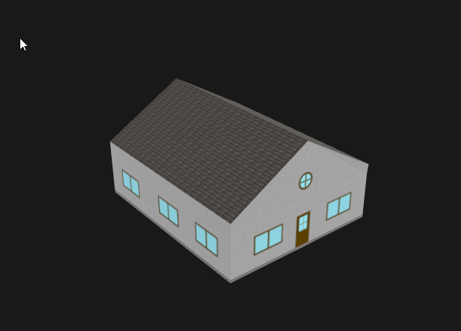

# CityJSON

.NET 6.0 Library for reading and writing CityJSON files (https://www.cityjson.org/)

NuGet package: https://www.nuget.org/packages/bertt.CityJSON/

## Dependencies

- NetTopologySuite

## Sample code

Reading CityJSON file:

```
var json = File.ReadAllText("fixtures/minimal.city.json");
var cityjsonDocument = JsonConvert.DeserializeObject<CityJsonDocument>(json);
```

Writing CityJSON file:

```
var json = CityJsonWriter.Write(cityjsonDocument);
File.WriteAllText("output.city.json", json);
```

Or use the convenience method:

```
CityJsonWriter.WriteToFile(cityjsonDocument, "output.city.json");
```

Sample reading CityJSON 2.0 Seq file and converting to NetTopologySuite:

```
var cityJsondocuments = CityJsonSeqReader.ReadCityJsonSeq("./fixtures/cityjsonseq/paris_tower.city.jsonl");
```

Writing CityJSON 2.0 Seq file:

```
CityJsonSeqWriter.WriteCityJsonSeq(cityJsondocuments, "output.city.jsonl");
```

Convert CityJSONDocument to NetTopologySuite:

```
var features = cityjsonDocument.ToFeatures(vertices, transform);
```

Converting CityJSON object to NetTopologySuite:

```
var feature = cityObject.ToFeature(vertices, transform);
```

## Tools

- cj2glb: from CityJSON to GLB

Created glTF file contains 3D Tiles extensions EXT_Mesh_features + EXT_Structural_Metadata for storing attribute information. Also a tileset.json
file is created with a reference to the glTF. When there is no projection info in the input file, some default projection is used.

Sample usage cj2glb:

- Download CityGML from https://www.citygmlwiki.org/index.php?title=FZK_Haus,_CityGML_3.0,_LoD2,_No_Storeys,_Boundary_Surfaces
and unzip

- Convert to CityJSON using citygml4j/citygml-tools:

```
$ docker run -v /data/fzkhaus:/data citygml4j/citygml-tools:2.4.0 to-cityjson /data/01-FZK-Haus-LoD2-Tex-no-Storey-CG30-V01.gml 
```

Result: 01-FZK-Haus-LoD2-Tex-no-Storey-CG30-V01.json

- Convert to GLB using cj2glb:

```
cj2glb 01-FZK-Haus-LoD2-Tex-no-Storey-CG30-V01.json fzk_haus.glb
```

Result: fzk_haus.glb



## Supports

- Geometry type support: Solid, CompositeSurface, MultiSurface, MultiSolid, CompositeSolid;

- Interior rings;

- Appearance support: Textures, Vertices-Texture; 

- CityObject - Address 

- Metadata support (EXT_Mesh_Features + EXT+Structural_Metadata)

- Creates tileset.json for use in 3D Tiles

- Reading and writing CityJSON files

## Limitations

- No support for extensions, materials;

## History

2025-11-12: release 2.4 - Adding writing support

2025-06-19: release 2.3 - Adding attributes support

2025-05-06: release 2.2 - Adding textures support

2025-01-15: release 2.1 - Reading CityJSON 2.0 Seq files

2024-12-06: release 2.0 - Refactoring - Reading geometries

2024-12-04: release 1.1 - to .NET 8.0

2022-11-22: from CityJSON 1.0.1 to CityJSON 1.1.2

2022-11-22: to .NET 6

2020-07-27: original coding
